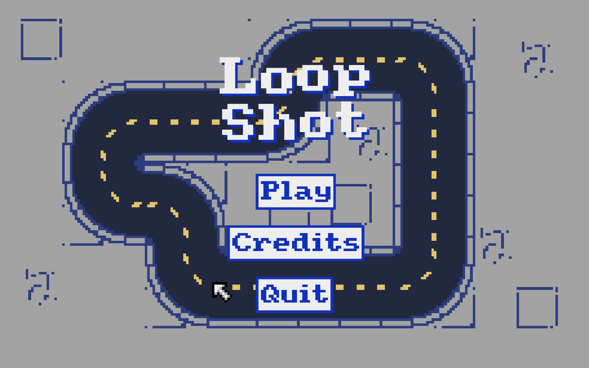

# 🎯 Loop Shot

A fast-paced wraparound arena shooter built in **72 hours** for the 2025 GMTK game jam.  
**Theme:** `Loop`, and here, everything loops: the arena, the bullets, and your strategy.

## 📸 Preview

## 🕹️ Gameplay

You control a small survivor in a looping arena filled with relentless bugs.  
Shoot enemies, but beware, your bullets loop around and can hit you if you’re careless!

## ▶️ How to play

You can play Loop Shot on [itch.io](https://leo-imbert.itch.io/loop-shot).

## 🔄 Key Features
- 🌀 **Wraparound Arena**: Bullets and enemies loop through screen edges.
- 👾 **Three Unique Enemies**:
  - **Scarab**: Chaser that uses smart wrapping.
  - **Spider**: Close-range pursuer.
  - **Hornet**: Ranged attacker with erratic movement.
- 🔫 **Self-damaging Bullets**: Watch your shots because they come back.
- 🎯 **30 Waves**: Increasingly difficult, filled with combos of enemies.

## 🧪 Controls

| Action     | Keys                        |
|------------|-----------------------------|
| Move       | `W` `A` `S` `D` or `Z` `Q` |
| Shoot      | Left Mouse Button           |
| Aim        | Mouse Cursor                |

## 🛠️ Built With

- [Pyxel](https://github.com/kitao/pyxel) – Retro game engine in Python.
- Python 3.10+
- Pure pixel art assets created during the jam.

## 📄 License

This project is licensed under the MIT License. See [LICENSE](/LICENSE) for more information.